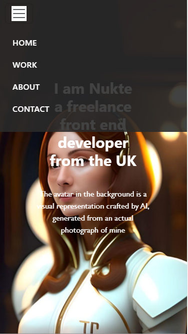

# BootsrapBioPage
Portfolio Layout powered by Bootstrap v5.3

# Front-End Developer Portfolio

A dynamic portfolio display presenting my works.

## Description

A website that exhibits my projects with sections for details about them, how to get in touch with me,skills I have, and samples of some of my projects.

Here is the link for my page:
[BootstrapBioPage](https://nukte-y.github.io/Bootstrap-Portfolio/).

## Installation
N/A

## Usage

The website was created using the Bootstrap library and its styling features. Additionally, to enhance the design's uniqueness, I introduced custom styling in the CSS folder.The navigation features a hamburger menu(visible when the device with is 575px or less).Moreover, the contact section provides convenient links to social media channels and a direct email option for easy communication

Explore different screen size views here:

  

  
  

**Note**: This is an initial version, and I plan to add more project links to the work section.

## Credits
N/A

## License
Please refer to the LICENSE in the repo.
